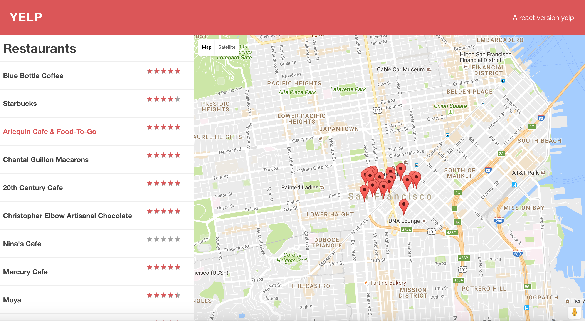
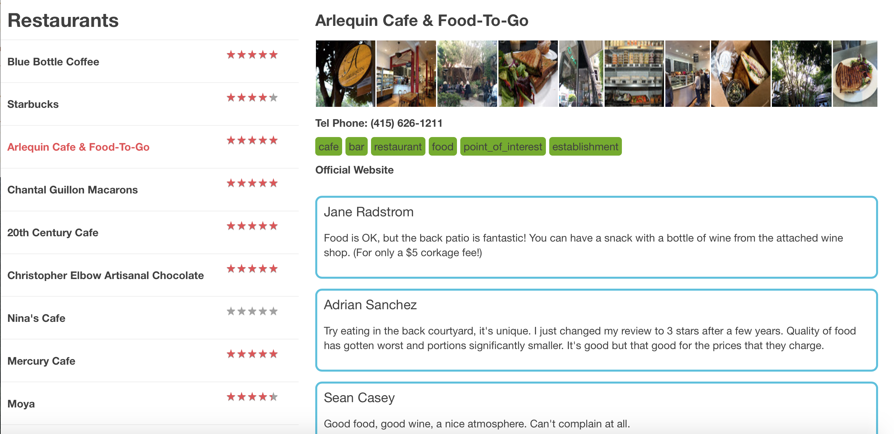

# react-yelp-web
Implement a yelp like website from scratch use ReactJS, babel, font-awesome, postcss, npm, webpack, and google map api. The website displays a list of restaurants nearby, all used to select to see detail, and enable user to rate based on a five-star. Successfully setup webpack config to config hot reloading, minification, pre/post css, ES6 tem- plates loaders for development and production environments. Effectively implement the react routes, main page and nested routes to display different restau- rants based on user selection using react-router. Integrate with Google Maps by use google-maps-react. Implement a five-star rating component based on react components.

How to run
1. run npm -install
2. npm start, it will run at localhost:3000
